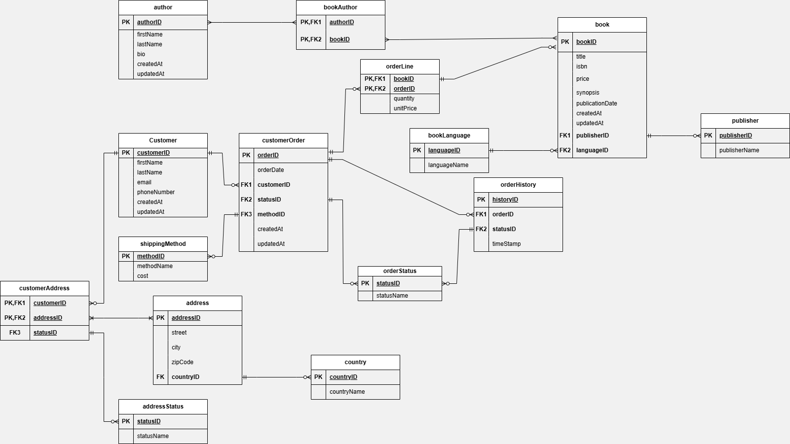

# 📚 Bookstore Database Group Project

  A structured relational database designed to manage all aspects of a bookstore's operations—from books, authors, publishers, and languages to customers, addresses, orders, and shipping.
  The design adheres to normalization standards and is scalable for large datasets and future features.

---

## 🗂️ Table of Contents

- [📚 Bookstore Database Project](#-bookstore-database-project)
- [🧩 ER Diagram](#-er-diagram)
- [🧱 Features](#-features)
- [🧾 Schema Overview](#-schema-overview)
- [📥 Installation](#-installation)
- [💡 Usage](#-usage)
- [🛡️ Roles and Permissions](#️-roles-and-permissions)
- [📦 Project Structure](#-project-structure)
- [📌 Future Enhancements](#-future-enhancements)
- [📜 License](#-license)

---

## 🧩 ER Diagram

The Entity-Relationship diagram shows the key relationships between entities like Book, Author, Customer, Order, and more.




---

## 🧱 Features

- Normalized data model
- Many-to-many relationships via junction tables
- Timestamp fields (`createdAt`, `updatedAt`) for tracking
- Role-based access control
- Full order processing system
- History and status tracking
- Modular schema

---

## 🧾 Schema Overview

### ✅ 1. Core Entities

#### `book`
- `book_id` (PK)
- `title`
- `isbn`
- `price`
- `language_id` (FK → `book_language`)
- `publisher_id` (FK → `publisher`)
- `createdAt`
- `updatedAt`

#### `author`
- `author_id` (PK)
- `first_name`
- `last_name`
- `bio`
- `createdAt`
- `updatedAt`

#### `book_author` (junction)
- `book_id` (PK, FK → `book`)
- `author_id` (PK, FK → `author`)

#### `book_language`
- `language_id` (PK)
- `language_name`

#### `publisher`
- `publisher_id` (PK)
- `publisher_name`
- `contact_email`
- `createdAt`
- `updatedAt`

---

### ✅ 2. Customer & Address

#### `customer`
- `customer_id` (PK)
- `first_name`
- `last_name`
- `email`
- `phone_number`
- `createdAt`
- `updatedAt`

#### `address_status`
- `status_id` (PK)
- `status_name` (e.g., current, old)

#### `country`
- `country_id` (PK)
- `country_name`

#### `address`
- `address_id` (PK)
- `street`
- `city`
- `state`
- `zip_code`
- `country_id` (FK → `country`)

#### `customer_address` (junction)
- `customer_id` (PK, FK → `customer`)
- `address_id` (PK, FK → `address`)
- `status_id` (FK → `address_status`)

---

### ✅ 3. Orders & Shipping

#### `cust_order`
- `order_id` (PK)
- `customer_id` (FK → `customer`)
- `order_date`
- `shipping_method_id` (FK → `shipping_method`)
- `status_id` (FK → `order_status`)
- `createdAt`
- `updatedAt`

#### `order_status`
- `status_id` (PK)
- `status_name` (e.g., pending, shipped, delivered)

#### `shipping_method`
- `shipping_method_id` (PK)
- `method_name`

#### `order_line`
- `order_id` (PK, FK → `cust_order`)
- `book_id` (PK, FK → `book`)
- `quantity`
- `unit_price`

#### `order_history`
- `history_id` (PK)
- `order_id` (FK → `cust_order`)
- `status_id` (FK → `order_status`)
- `timestamp`

---

## 📥 Installation

1. Clone this repository:
   ```bash
   git https://github.com/Denis-Mwanzia/BookStoreDb.git
2. Open MySQL workbench
3. click on ```File2``` then select and click on ```Open SQL Script```
4. Select and open the folder ```BookStoreDb``` and select ```createDatabase.sql``` then click on open
5. Run the script
6. Repeat step 3 and 4 but select and open  ```createTables.sql``` then step 5

***Repeat the same procedure for all the other files***

---

## 💡 Usage
You can:
1. Add new books, authors, and publishers
2. Register customers and their addresses
3. Track orders and shipping history
4. Analyze sales through complex SQL queries

## 🛡️ Roles and Permissions
Set up roles such as:

    admin: Full access

    sales: Can read/write customers and orders

    customer: Can only view data


--- 

## 📌 Future Enhancements
   1. Add stored procedures for order placement
   2. Generate sales reports
   3. Integrate frontend dashboard
   4. Add audit logs for changes

---

## 📜 License
MIT License — ```feel free to use and adapt.```
